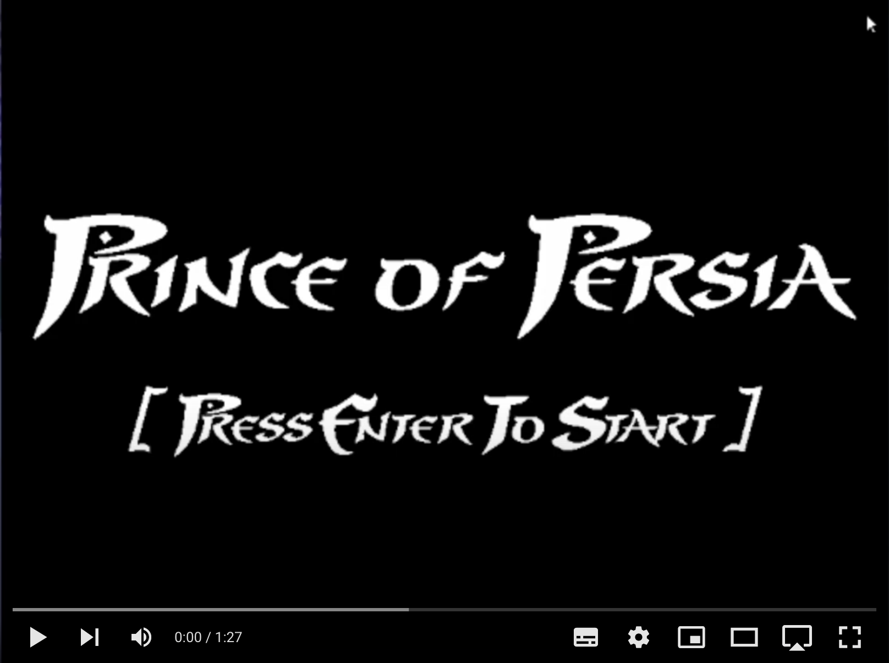

# Prince_of_Persia

Welcome to our representation of the timeless **Prince_of_Persia**!

Here you can find everything about the game and its development:

1. [User Instructions](docs/UserInstructions.md)

   1.1. [Concept](docs/UserInstructions.md#11-Concept)
   
   1.2. [Initial Screen](docs/UserInstructions.md#12-Initial-Screen)
   
   1.3. [Instructions](docs/UserInstructions.md#13-Instructions)
   
   1.4. [Game Screen](docs/UserInstructions.md#14-Game-Screen)
   
   1.5. [Fighting Screen](docs/UserInstructions.md#15-Fighting-Screen)
   
   1.6. [Scoreboard](docs/UserInstructions.md#16-Scoreboard)

2. [Project Status](docs/ProjectStatus.md)

   2.1. [IO Devices Used](docs/ProjectStatus.md#21-IO-Devices-Used)
   
   2.2. [Timer](docs/ProjectStatus.md#22-Timer)
   
   2.3. [Keyboard](docs/ProjectStatus.md#23-Keyboard)
   
   2.4. [Mouse](docs/ProjectStatus.md#24-Mouse)
   
   2.5. [Graphics Card](docs/ProjectStatus.md#25-Graphics-Card)
   
   2.6. [Real Time Clock](docs/ProjectStatus.md#26-Real-Time-Clock)

3. [Code Organization](docs/CodeOrganization.md)

   3.1. [Function Call Graph](docs/CodeOrganization.md#31-Function-Call-Graph)

   3.2. [main.c](docs/CodeOrganization.md#32-mainc)
   
   3.3. [kbd.c](docs/CodeOrganization.md#33-kbdc)
   
   3.4. [rtc.c](docs/CodeOrganization.md#34-rtcc)
   
   3.5. [timer.c](docs/CodeOrganization.md#35-timerc)
   
   3.6. [mouse.c](docs/CodeOrganization.md#36-mousec)

   3.7. [state.c](docs/CodeOrganization.md#37-statec)

   3.8. [utils.c](docs/CodeOrganization.md#38-utilsc)
   
   3.9. [video_gr.c](docs/CodeOrganization.md#39-videogrc)
   
   3.10. [map.c](docs/CodeOrganization.md#310-mapc)
   
   3.11. [prince.c](docs/CodeOrganization.md#311-princec)
   
   3.12. [princess.c](docs/CodeOrganization.md#312-pricessc)

   3.13. [thief.c](docs/CodeOrganization.md#313-thiefc)

   3.14. [target.c](docs/CodeOrganization.md#314-targetc)
   
   3.15. [text.c](docs/CodeOrganization.md#315-textc)
   
   3.16. [scoreboard.c](docs/CodeOrganization.md#316-scoreboardc)
   
   3.17. [Data Structures](docs/CodeOrganization.md#317-Data-Structures)
   

4. [Implementation Details](docs/Implementation.md)

   4.1. [Triple Buffering](docs/Implementation.md#41-Triple-Buffering)
   
   4.2. [RTC](docs/Implementation.md#42-RTC)

5. [Conclusion](docs/Conclusion.md)

   5.1. [Problems and Delays](docs/Conclusion.md#51-Problems-and-Delays)
   
   5.2. [Future Works](docs/Conclusion.md#52-Future-Works)
   
   5.3. [Main Achievements](docs/Conclusion.md#53-Main-Achievemnts)
   
   5.4. [Lessons Learned](docs/Conclusion.md#54-Lessons-Learned)

This project was developed by 

* [Athos Freitas](https://github.com/athoscf)
* Benedita Bacelar
* [João Figueiredo](https://github.com/Oao26)
* [Sofia Pinto](https://github.com/SofiaViP)

Thank you!
