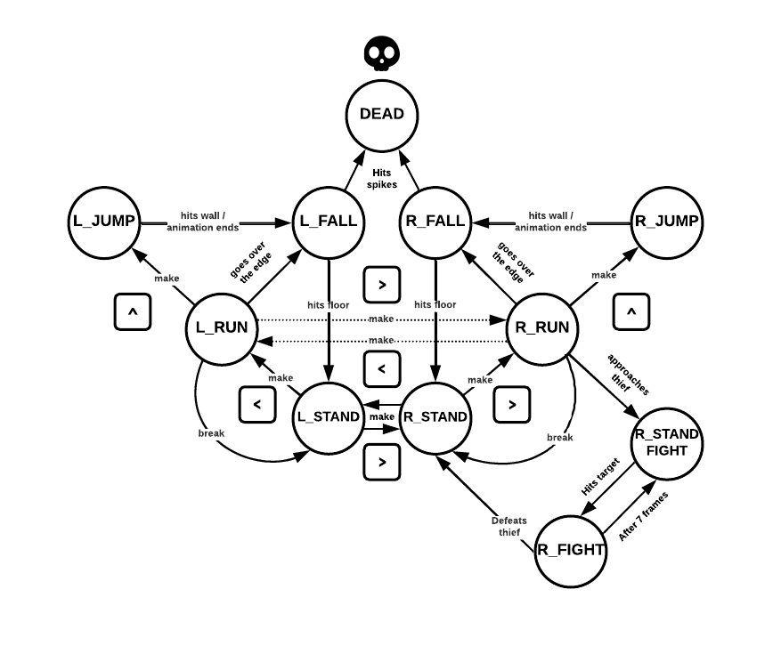

## 3. Code Organization

### 3.1. Function Call Graph

*Figure 11:* Function call graph (available in doxygen)

### 3.2. main.c

The main module serves as the starting point of our project and carries out several crucial tasks. It calls the configuration functions from other modules, which involve subscribing and unsubscribing interrupts, enabling and disabling data reporting, and setting the video graphics mode. Additionally, the main function invokes functions responsible for loading the scores and the XPM images, ensuring the necessary graphical assets are available for the game. Most importantly, it encompasses the game loop, which operates within a while loop. This loop includes the driver receive operation, responsible for receiving interrupts and invoking the corresponding handler functions. The loop continues until the user presses the ESC key, at which point it breaks, allowing for the termination of the game execution, but not before saving the scores in a text file.

### 3.3. kbd.c

This module serves the purpose of incorporating and configuring the keyboard within our project. It consists of various functions to enable the subscription and unsubscription of interrupts, as well as the handling of these interrupts. Additionally, it allows the loading, drawing, and removal of cursor XPM images. The pivotal function within this module is the interrupt handler, which is responsible for receiving and processing scancodes, subsequently triggering appropriate actions within the game.

### 3.4. rtc.c

This module deals with the Real Time Clock. It contains necessary functions for setting up interrupts as well as handling interrupts. This module also contains functions that update both a in-game timer and the current date-time. In addition rtc.c also contains the necessary functions to draw the timer whenever it is updated, making the in-game timer visualization fall under this module's responsibility.

### 3.5. timer.c

This module is primarily responsible for the seamless integration and implementation of the timer within our project. It serves as a central hub for managing various critical tasks, including the subscription and unsubscription of interrupts, handling interrupt events, and executing essential operations for loading, drawing, and erasing XPM images. At the core of this module lies its interrupt handler function, which orchestrates the progressive rendering of game elements such as the mouse, prince, thief, and targets, ensuring a smooth and consistent visual experience with a fixed frame rate. Moreover, the interrupt handler dynamically decreases the number of targets with each passing second, adding a time-based challenge to the game-play.

### 3.6. mouse.c

This module's purpose is the implementation and configuration of the mouse in our project. It encompasses functions for subscription and unsubscription of interrupts, enabling and disabling of data reporting, handling the irrupts and finally loading, drawing, and erasing the cursor XPM images. The key function is the interrupt handler, it is responsible for successively continuously updating the mouse position, and, if the player finds himself in a fight, it shall assess if he hits the targets or not. This is achieved through the following state machine:

*Figure 12:* Mouse State Machine

### 3.7. state.c

This module is responsible for facilitating the transition between different game modes by invoking the necessary erase and draw functions based on the current and new modes. The **set_mode(game_mode_t new_mode)** function first erases elements associated with the current mode, such as menus, characters, timers, and cursors. Then, it updates the mode and draws the elements corresponding to the new mode.

### 3.8. utils.c

This auxiliary module provides utility functions for tasks such as reading bytes from a specified port, reading data from the i8042's output buffer, and issuing commands to the i8042. These functions enhance the efficiency and reliability of input/output operations within the system.

### 3.9. video_gr.c

This module is responsible for initializing the video mode, as well as drawing and erasing the pixmaps in our game. It also plays an important role in the triple buffering mechanism, since its where the buffers are created and then swapped.

### 3.10. map.c

This module encompasses the necessary information about the positions and sizes of brick walls, which collectively form the map for each game mode. It provides functions for loading, drawing, and erasing these walls. Furthermore, the module enables the adjustment of the prince's initial position when transitioning between different maps.

### 3.11. prince.c

This module handles various aspects of the prince character, including animations, movement behaviors like running, jumping, attacking, collision detection, as well as loading, drawing, and erasing the prince on the screen. Additionally, it manages the prince's health through a hearts system, tracking the remaining hearts, updating the display, and responding to heart loss events. Overall, the module contributes to an immersive and interactive experience centered around the prince character in the game.

*Figure 13:* Prince State Machine

### 3.12. princess.c

This module is responsible for the presence of the princess in our game. Without it, our main character wouldn't be able to fulfill its only purpose: saving the princess.

### 3.13. thief.c

The thief module shares similarities with the prince module, but with some distinct differences. In a similar fashion, the module handles loading, drawing, and erasing the thief character on the screen. However, unlike the prince, the thief has a fixed position and does not require running, jumping or collision detection, although the module allows the thief to display an attack animation.

### 3.14. target.c

This module handles the targets within the context of fights. It encompasses functionalities such as resseting and randomizing the attributes of targets (size, position, and color - red or blue), loading, drawing, and erasing the respective XPM images based on the target's color and size. The module also includes features for shrinking a target by changing its XPM image to a smaller version. It essentially manages the dynamic aspects of targets, ensuring their appropriate representation and behavior during fights.

### 3.15. text.c

The text.c module relates mainly to displaying the game's menus. The key functionalities include, rendering the main menu, instruction menu and the scoreboards static components. This module also calls the necessary functions within the module scoreboard.c in order to display the current scoreboard and player score. Notably, this module also leverages the erase function for all it's menus and correspondingly calls the scoreboards erase function.

### 3.16. scoreboard.c

This module controls functionalities relating to the game's scoreboard. It's primary responsibilities are loading and saving the scoreboard data to a text file, calculating the player's score (based on the number of lives remaining and time taken to complete the game), evaluating if the player score is a top score. If the player has achieved a top score the module will update the leaderboard accordingly. Furthermore, this module also provides the necessary functions for drawing the leaderboard and the player's score on the screen as well as a function to erase them.

### 3.17. Data Structures

**date_time_t** - Struct for the date time, its attributes are the year, month, day, hour, minute and second.

**position_t** - Struct used to store the position and size of the objects that are going to be displayed.

**game_timer_t** - Struct for the in game timer display.

**map_t** - Struct for the game's maps used to build each level.

**collision_data_t** - Struct for collision analysis

**high_score_t** - Struct for the game's scoring system which includes, date, time and score.