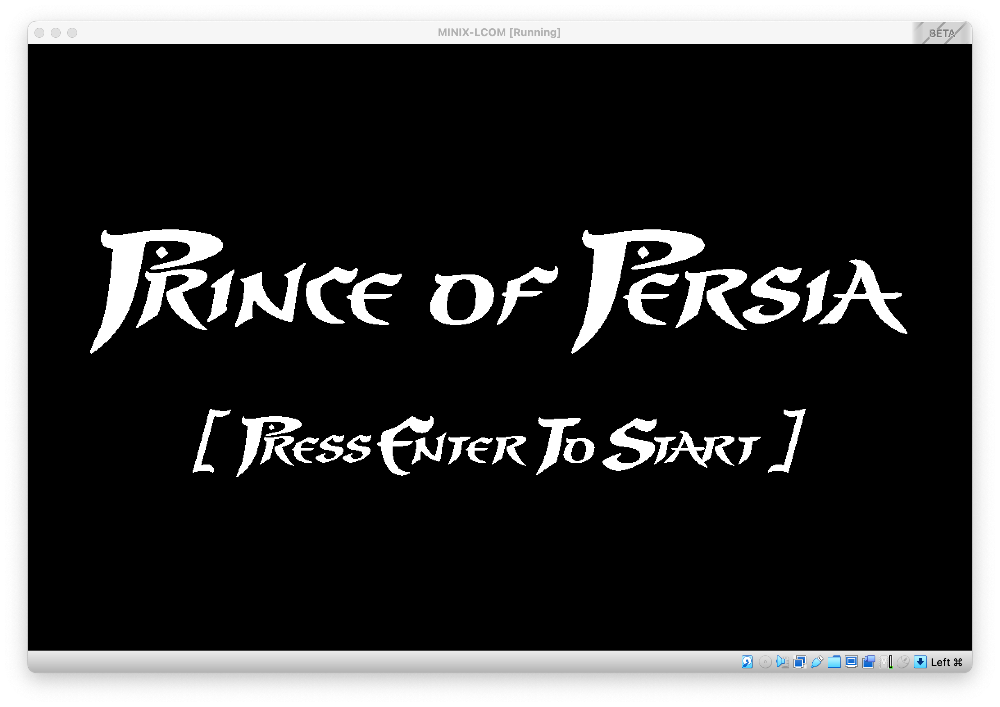
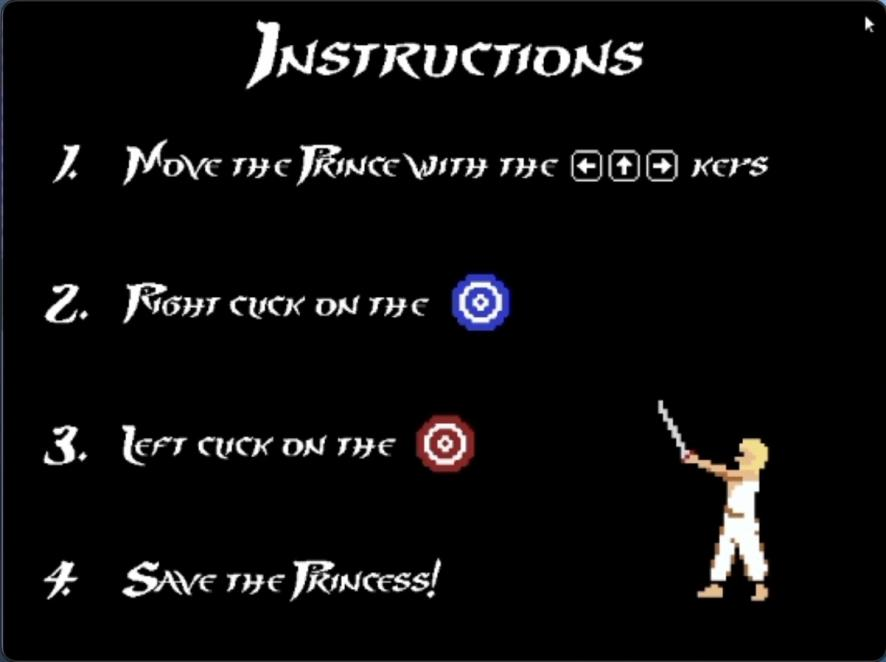
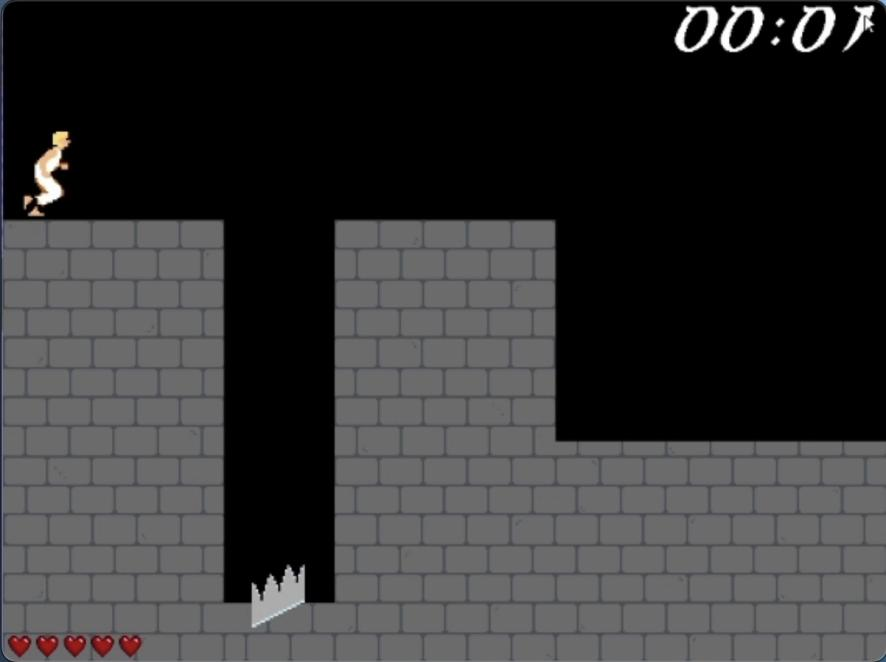
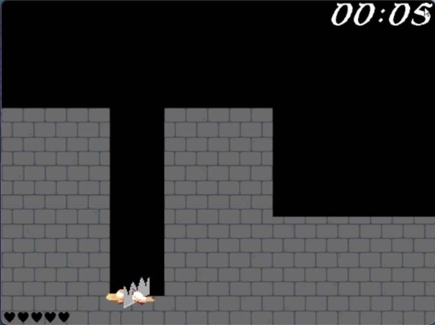
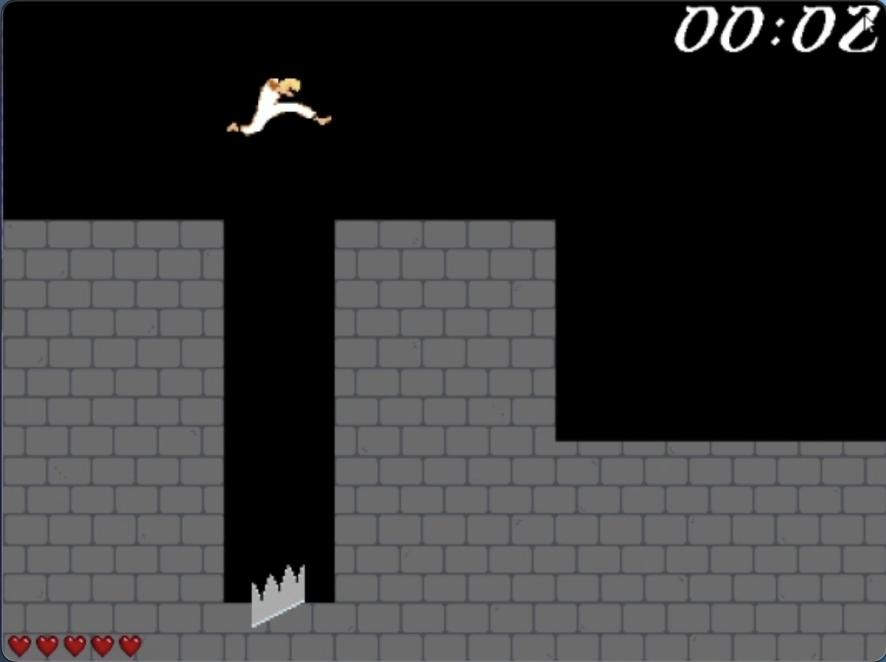
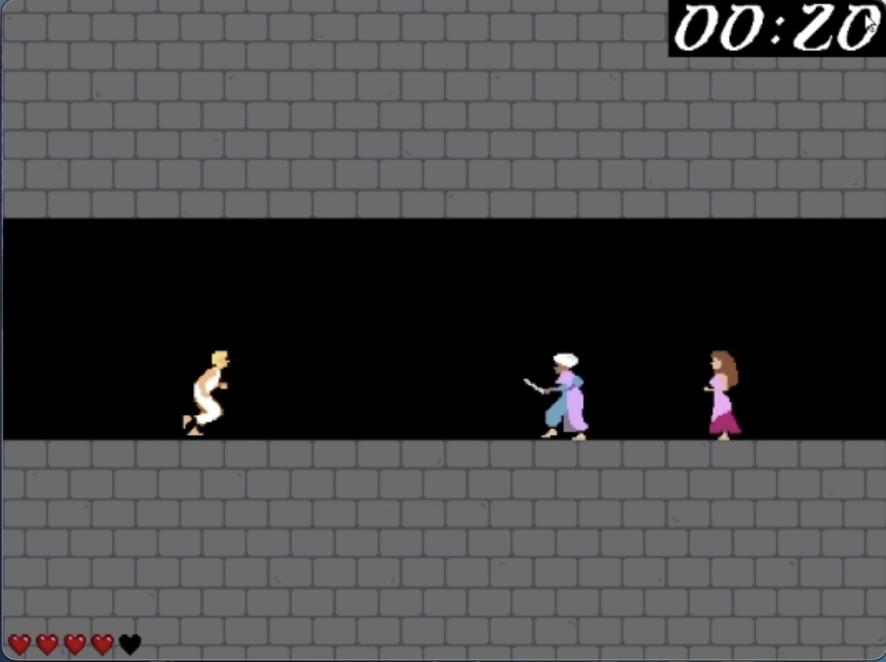
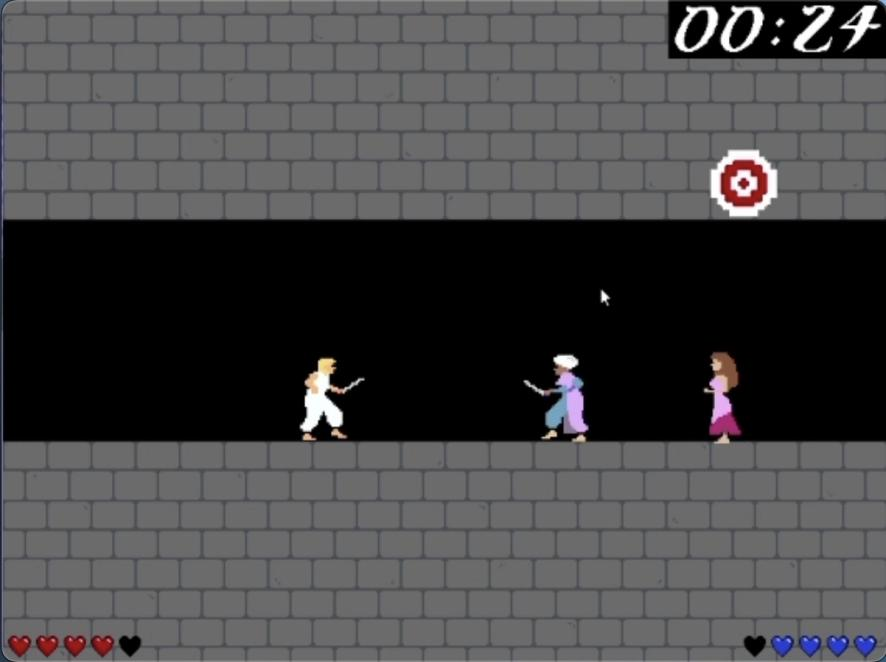
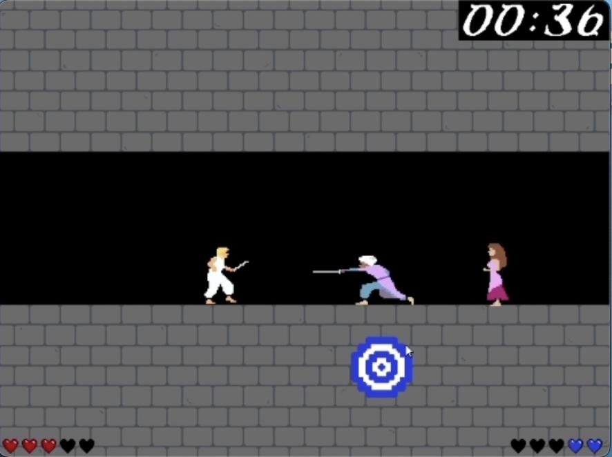
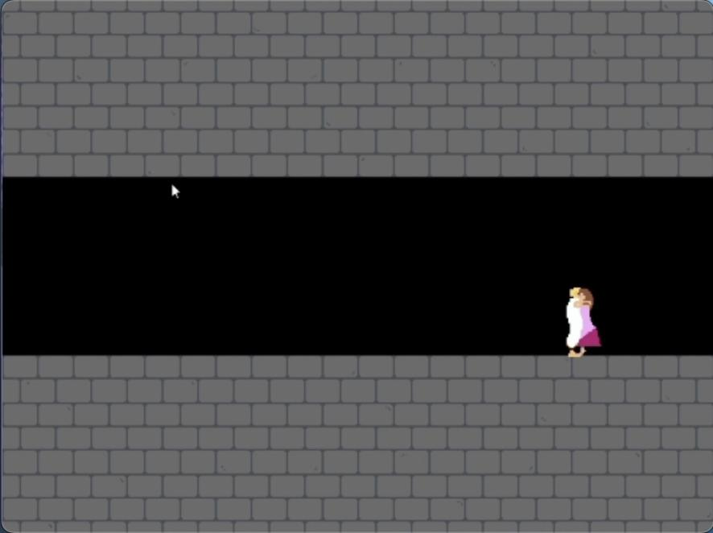
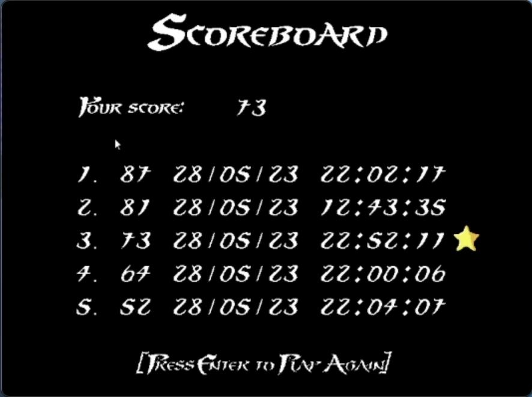

## 1. User Instructions

### 1.1. Concept

Adaptation of famous game developed in 1989, Prince of Persia.

### 1.2 Initial Screen

Once the application is booted, the user is greeted with the following screen. The user should press \textbf{Enter} to start the game.
Whenever the user loses the game, he is redirected to this page.
There is always the option to quit, by pressing \textbf{Esc}, at any given point of the game.

*Figure 1:* Initial Screen

### 1.3. Instructions

Here, the user is presented with some visual and straightforward instructions. As shown, our goal is to save the stunning princess, by moving the prince with the arrow keys, and hitting the targets, using the mouse. More on these topics will be discussed later on.

*Figure 2:* Instructions

### 1.4. Instructions

Here is where the action begins. The user is now portraying our Prince, stuck in a brick maze full of obstacles. We can also spot the Prince's current lives, in the bottom-left corner of the screen, as well as a chronometer in the top-right corner of it.

*Figure 3:* Let the game begin!

Keep in mind that not all falls have the same depth. Therefore, ones can hurt you more than others do, which can lead you to lose valuable lives. Also, be aware of the spikes! In case you unfortunately fall in one of them, you'll instantly die, and need to start all over again, in order to save your beloved princess.

*Figure 4:* Death by spikes!

As mentioned above, the user should move the prince using the \textbf{arrow keys}. He can freely move either to the left or to the right. There's even the possibility to jump, by pressing both the left/right key, and the upper key. This way, you are now capable of facing any obstacles which might cross your path!

*Figure 5:* Jump!

### 1.5. Fighting Screen

After passing through the first two rooms, the player will enter the final screen of the game: the Fighting Screen. This one differs from the others, since there is a thief waiting to attack. The graphic interface is very similar to the previous ones, being the main differences the presence of the antagonist and its lives.

*Figure 6:* Before the fight

In order to initiate the fight, the Prince should get clone enough to the villain. Once he's within its reach, the encounter begins. Then, targets will begin to appear in the screen, which can belong to one of two types: Attack or Defense.

The former ones are characterized by their Red color. Once in the screen, the user should proceed to click on them with the \textbf{left button} of the mouse, before they are gone. In case the user accomplishes this task, he will damage the opponent. Otherwise, the player loses a valuable opportunity to win this fight.

*Figure 7:* Fight Scene 1

The latter ones are depicted as Blue targets. These will allow the Prince to defend himself from the enemy attacks. As a mean to accomplish it, the user should \textbf{right click} on the target, or else he will suffer damage from its opponent and lose an irretrievable health point.

*Figure 8:* Fight Scene 2

It's worth noticing that the user should reach for the targets as quickly as possible, since these get progressively smaller and harder to hit.

After the fight, the Prince will get to finally be with his beloved one, as depicted in the picture below.

*Figure 9:* The Love Hug

### 1.6. Scoreboard

After winning the game (i.e. defeating the thief, and saving the princess), the user is redirected to the scoreboard, where he can check the top-5 scores achieved so far. In case he is between these a star will appear right next to its score, as displayed below.

*Figure 10:* Scoreboard